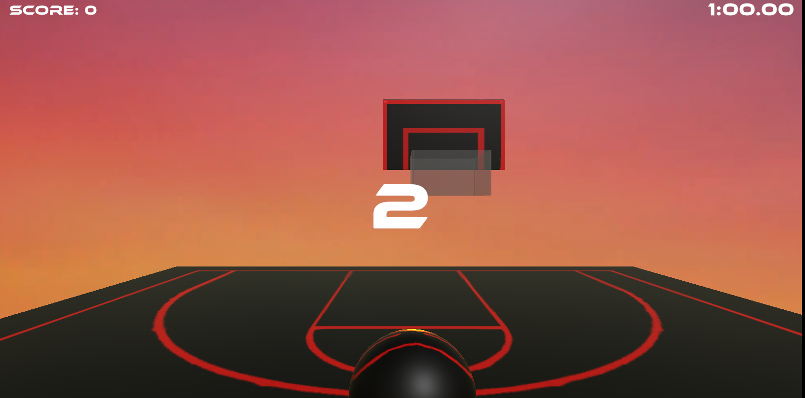

# **Neon Hoops**
A simple 3-D physics-based unity game built with Unity.

# Overview
Neon Hoops is a single-player 3-D basketball game developed in Unity. Currently there are two game modes, Classic and PoweredUp. Classic is a nearly complete gamemode that simply consists of the player shooting the ball into a translating hoop to get as many points until time runs out. PoweredUp (Still in Development) doesn't have a time limit, but rather a lives system where the player has to avoid incoming obsticles while also looking for powerups and shoot the ball into the hoop. 

*Note: Neon Hoops is still a work in progress so user's may encounter bugs

# Overall Features
- Physics-based basketball mechanics including trajectory, rotation, and collisions
- Scoring and timing system
- Game menu UI
- Music and SFX

## Classic Mode
- User can decide which difficulty they want to play: Easy, Medium, Hard
- Difficulty correlates with the speed of the hoop, so easy is slower, while hard is fast
- User presses the spacebar to shoot the ball and has to correctly time their shot
- Score updates in the top-right corner of the screen
- A one-minute timer counts down and the user has to score as many points as possible before time runs out
- Once time does run out, a buzzer will sound and an end of game menu will appear

## Powered Up (Still in Development)
- Same shooting mechanics as Classic mode except the user can now user their mouse cursor to move the ball left and right
- Asteroids fly toward the user's camera and the user has to avoid them or else they will lose one of their three lives
- There are three types of powerups, Freeze Hoop, Moneyball, and Force-Field
   - Freeze Hoop: Will freeze the hoop for 10 seconds while the user can keep shooting at a still hoop
   - Moneyball: Lasts for 5 seconds and made baskets will count for two points instead of 1
   - Force-Field: Protects the user from asteroid collisions for 5 seconds or until a collision between the ball and asteroid

# Technologies Used
- Game Engine: Unity (C#)
- Physics Engine: Unity's built-in physics system
- UI: Unity's built-in UI for menus and score tracking

# How to Play Neon Hoops
## Web (Unity Play)
- Open [Neon Hoops](https://play.unity.com/en/games/c29db0f9-4e13-4f0a-8aa6-4400760b4bd5/neon-hoops) in a browser window
- Press Play 

## Local (using Unity)
- Clone this repository and open the project in Unity
- Play in the Unity Editor or build the project on your local machine

# Gallery

